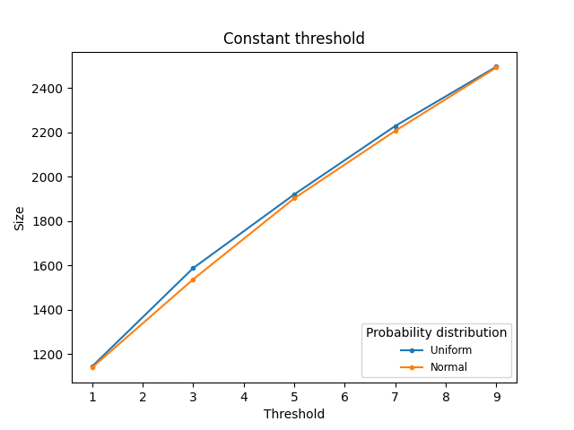
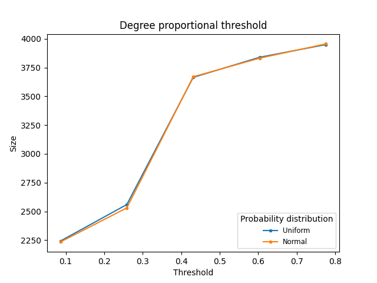

# Targeting with Partial Incentives

Data una rete sociale rappresentata da grafo G = (V,E), dove V è l'insieme dei nodi
della rete, E è l'insieme degli archi che rappresentano i collegamenti tra i nodi della rete, ed una threshod function t: V → N dove t(v) indica il numero di adiacenti
attivi del nodo v necessari ad attivare v, si vuole trovare un insieme di nodi che sia in grado di influenzare l'intera rete.
Un **assegramento di incentivi parziali** ai vertici del grafo G con V = v1, ... , vn è un vettore s = (s(v1), ... , s(vn)) ∈ {0,1,2, ...} rappresenta la quantità di influenza applicata al nodo v ∈ V.  
Un **processo di attivazione** in G che inizia con un vettore di incentivi è una sequenza *Active[s,0]* ⊆ *Active[s,1]* ⊆ ...  ⊆ *Active[s,l]* ⊆ ... ⊆ V di sottoinsiemi di vertici con:
* *Active[s,0]* = {v: s(v) > t(v)},
* *Active[s,l]* = *Active[s,l-1]* U {u: |N(u) ∩ *Active[s,l-1]*| ≥ t(u) - s(u)}, ∀l>0.
## Obiettivo
Un **vettore target** s è un'assegnazione di incentivi parziali che innesca un processo di attivazione che influenza l'intera rete, cioè tale che *Active[s,l]* = V per un *l*≥0. L'obiettivo è trovare il vettore s che minimizza il totale degli incentivi per avere *Active[0,∞]* = V , cioè un vettore s che minimizzi *C(s)* = Σ s(v) ∀ v ∈ V.
## Implementazione
L'algoritmo presentato è stato implementato utilizzando Python 3.6 e la libreria SNAP per la manipolazione dei grafi; il dataset utilizzato per l'implementazione è *datasetgemsec-Facebook* contenente dati collezionati dalle pagine Facebook verificate e caratterizzate dalla spunta blu accanto al nome; data la sua divisione in categorie, la scelta è caduta su quella delle *Public Figures* contenente 11565 nodi e 67114 archi.  Ogni nodo del grafo rappresenta una pagina mentre gli archi i like reciproci tra di esse. Queste pagine rappresentano individui, entità e organizzazioni con elevata visibilità.
Si utilizza un modello di attivazione con threshold; dato un grafo non direzionato G = (V,E), una threshold function *t* : V → N e una distribuzione di probabilità associata agli archi di G, *p* : E → [0,1]:
* Applicare il *principio di decisione differita*: per ogni arco *e* del grafo viene generato un numero pseudocasuale *x* compreso tra 0 e 1. Se *x* < *p(e)* (cioè il nodo infetta con una probabilità inferiore rispetto a quella richiesta), allora l'arco *e* viene rimosso dal grafo.
* Eseguire l'algoritmo sul grafo ottenuto: il grafo è dato in input all'algoritmo che calcola la soluzione. Questa procedura è iterata 10 volte, poi viene calcolata la dimensione media delle soluzione ottenute.

Il progetto è quindi suddiviso in 3 file:
* [TPI.py](https://github.com/Peppen/Targeting-with-Partial-Incentives/blob/master/TPI.py) contenente l'implementazione dell'algoritmo TPI.
* [deferred_decision.py](https://github.com/Peppen/Targeting-with-Partial-Incentives/blob/master/deferred_decision.py) che implementa il processo di decisione differita. Per le probabilità è possibile scegliere tra *distribuzione uniforme* e *distribuzione normale*. 
* [main.py](https://github.com/Peppen/Targeting-with-Partial-Incentives/blob/master/main.py) che implementa l'esecuzione dell'algoritmo e la generazione dei grafi.

## Thresholds Costanti

In Figura 1 è mostrata l’esecuzione dell’algoritmo, dopo aver applicato il principio di decisione differita al grafo, utilizzando thresholds costanti per tutti i nodi. In particolare, si è partiti assegnando ad ogni nodo una threshold pari a 1, e successivamente si è incrementata la threshold ad ogni esecuzione. Dato il gran numero di nodi e archi, l’incremento avviene con uno step pari a 2, e ci si è fermati al valore 11, che corrisponde al grado medio.

## Thresholds Proporzionali

In Figura 2 è invece mostrata l’esecuzione dell’algoritmo utilizzando thresholds proporzionali al grado del nodo. La strategia di esecuzione è la stessa, ma le threshold stavolta sono calcolate tenendo in considerazione il grado del nodo: *t(v)* = *(deg(v) *** i)*/ *iter* dove, *t(v)* è la threshold assegnata al nodo *v*, *dev(v)* è il grado del nodo, *i* è l’iterazione attuale, *iter* è il numero di iterazioni totali (ovvero, il grado medio).

## Risultati
In entrambi i casi vengono mostrate i risultati utilizzando sia la distribuzione uniforme che la distribuzione normale per la generazione delle probabilità assegnate
agli archi. Per quanto riguarda *thresholds costanti* la size aumenta linearmente, con *thresholds proporzionali* abbiamo un salto, le size sono già alte a valori bassi per le
threshold.

